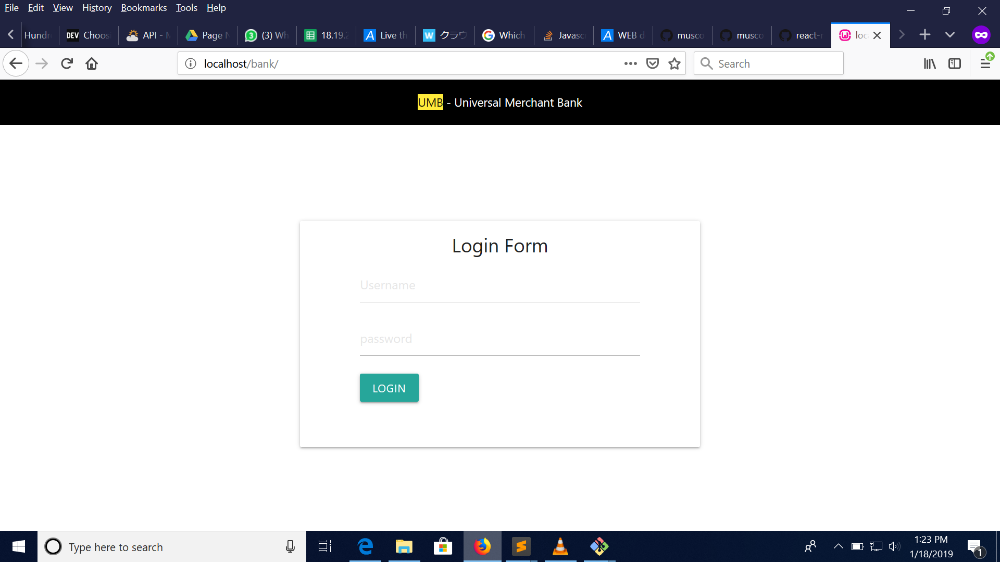
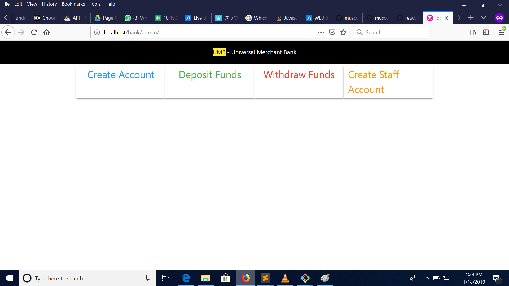
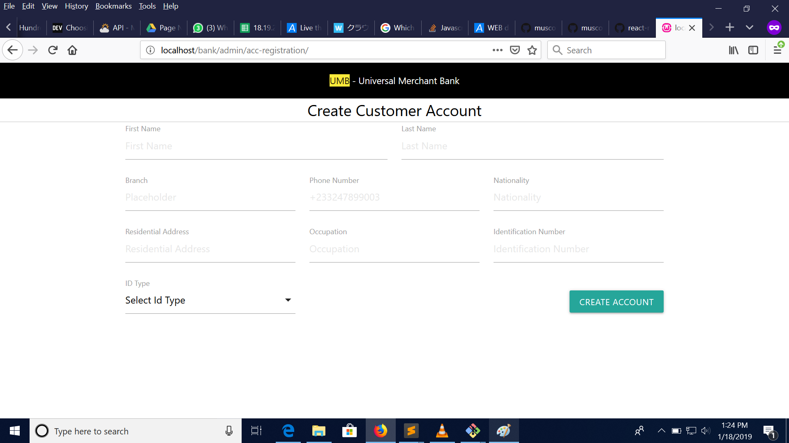
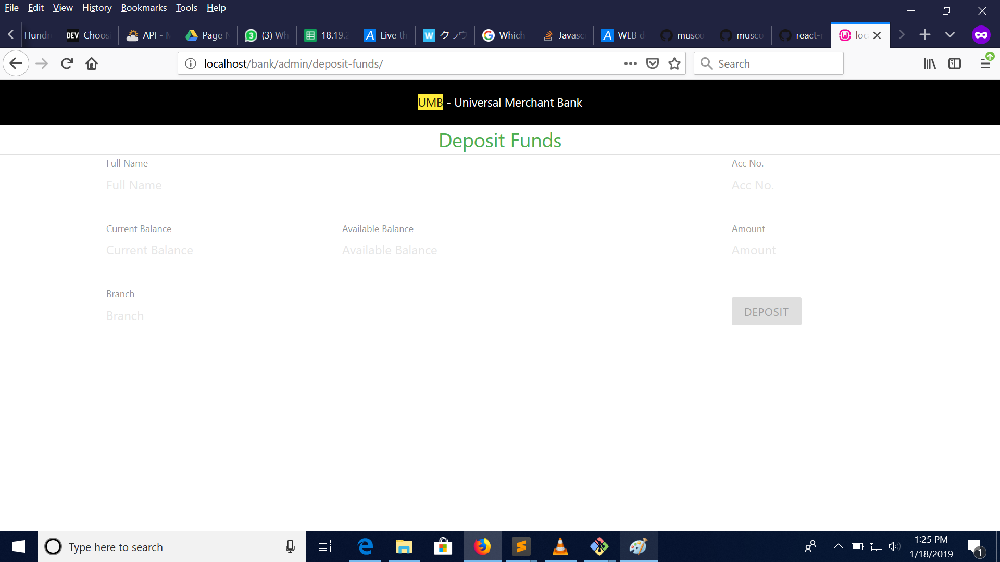
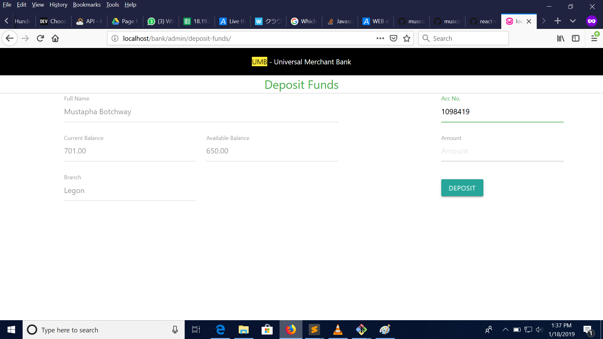
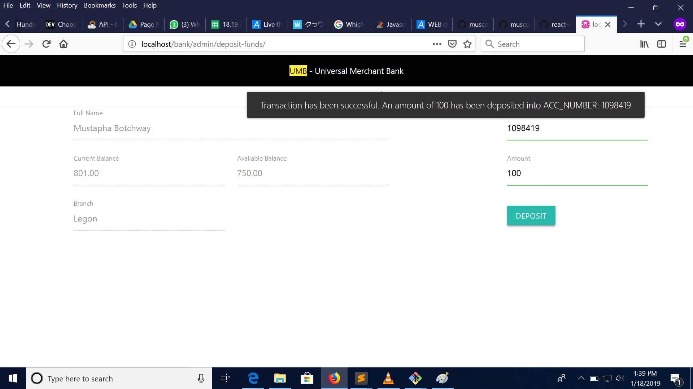
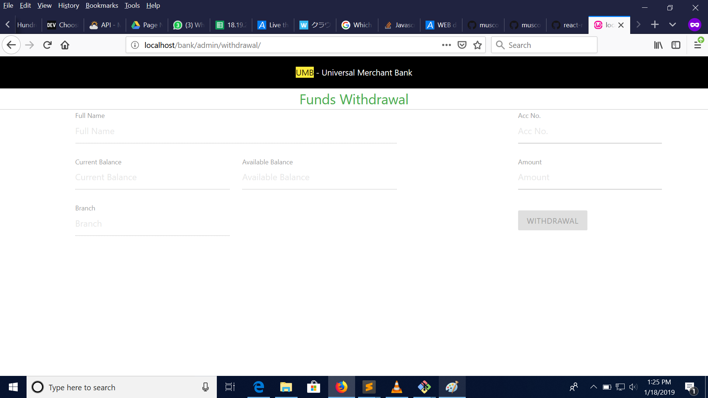
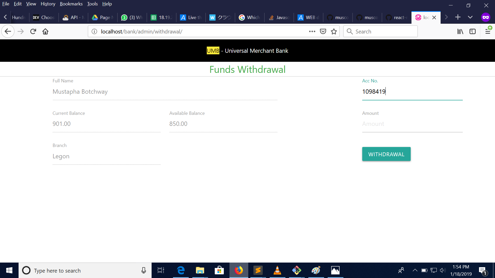
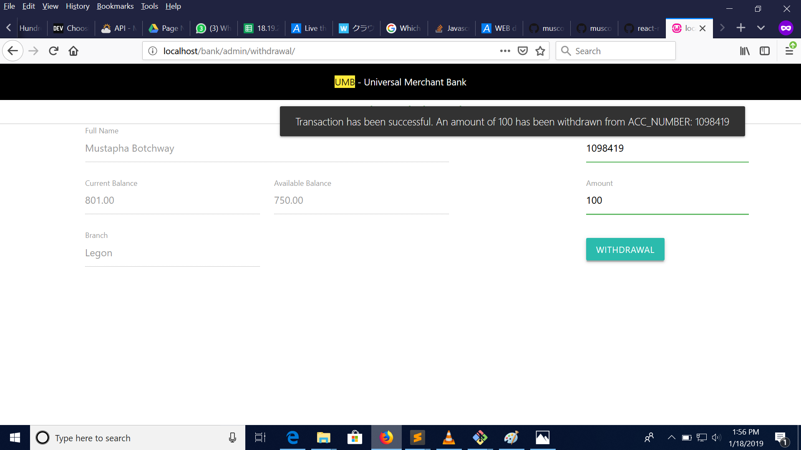
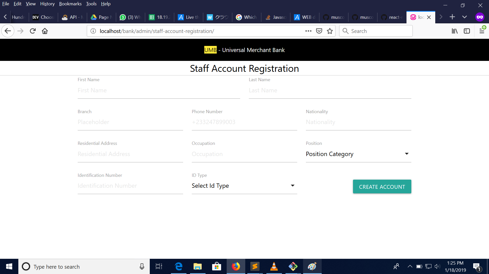

#MY Bank APP
<h1>Banking Application</h1>

<h4>This is a simple banking application in php</h4>
<h6>The features of this application include: </h6>
<ul>
	<li>Login</li>
	<li>Admin Page</li>
	<li>Create Account</li>
	<li>Deposit Funds</li>
	<li>Withdraw Funds</li>
	<li>Create Staff Account</li>
</ul>

<h1>This is hosted locally for now</h1>

First Interface

<h4>Login screen</h4>

Authorized users are required to enter their login credentials to be able to navigate to
the main admin page

<h4>Main Admin Page</h4>

The main admin page provides four different pages the admin can navigate to

<h4>Create Account</h4>

The Create Account Pages enables the user to create a bank account for new customers

<h4>Deposit Funds</h4>

The Deposit Funds Page enables the tellers to deposit funds into a customer's account

The deposit button is disabled

The button is only enabled when the correct account number is entered

The account number entered is asynchronously checked in the database to for it's validity

The moment a correct account number is entered, brief details of the customer account is populated at the right place as seen below

When an amount is entered and the deposit button is pressed, the administrator gets an alert on the screen confirming a successful transaction and the page is automatically refreshed

<h1>Withdraw Funds</h1>

The Withdraw Funds page also follows the same logic as the deposit

First a correct customer account number must be entered

The account number entered is asynchronously checked in the database to for it's validity

If the account number is valid and exist in the database, a brief account details of the customer is presented to the Teller

The withdraw button is later enabled.

After a successful Transaction, the teller gets an alert confirming success and the page is refresh

<h1>Staff Account</h1>

The Staff Page enable users like the HR to add new Staff to the system

<h1>Please know that this project is not yet complete and that proper authorization for the different users of the system would be put in place</h1>
